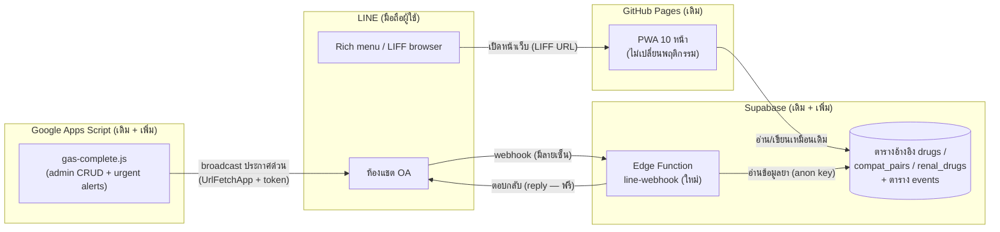

# ช่องทาง LINE (LINE Channel) — ภาพรวม

> เอกสารชุดนี้อยู่ใน `docs/` ซึ่ง **ไม่ถูก deploy ขึ้นเว็บ** (build.js ไม่ copy โฟลเดอร์นี้)
> ใช้เป็นคู่มือภายในสำหรับเจ้าของโปรเจกต์เท่านั้น

## เป้าหมาย

เพิ่ม LINE เป็น **ช่องทางเสริม** ในการเข้าถึง IV DrugRef โดย **PWA เดิมทำงานเหมือนเดิมทุกอย่าง**
(additive only — โค้ดใหม่ทุกส่วนอยู่หลัง feature detection หรือเป็น URL parameter ใหม่)

ฟีเจอร์ 4 อย่าง เรียงตามลำดับที่จะทำ:

1. **เมนูลัด (rich menu)** — กดปุ่มใต้ห้องแชตของ LINE OA แล้วเปิดหน้าแอปที่ต้องการ
2. **แชตบอตถาม-ตอบ** — พิมพ์ชื่อยา / คู่ยา / renal ในแชต แล้วบอตตอบจากฐานข้อมูลชุดเดียวกับแอป
3. **แจ้งเตือนประกาศด่วน (urgent alert)** — admin กดส่ง broadcast ถึงผู้ติดตาม OA
4. **ปรับปรุงปุ่มแชร์** — แชร์ผลลัพธ์เข้า LINE ด้วยหน้าต่างแชร์จริง (แทนการคัดลอกข้อความ)

## สถาปัตยกรรม

**ศัพท์ที่ควรรู้** (อธิบายละเอียดในคู่มือแต่ละ phase):

| ศัพท์ | ความหมายสั้น ๆ |
|---|---|
| **LINE OA** | บัญชี LINE แบบองค์กร (Official Account) — มีอยู่แล้ว |
| **Rich menu** | แผงปุ่มภาพใต้ห้องแชตของ OA ตั้งค่าในเว็บ LINE OA Manager ไม่ต้องเขียนโค้ด |
| **LIFF** | LINE Front-end Framework — วิธีเปิดเว็บของเราแบบเต็มจอในแอป LINE (ชี้ URL ไปที่เว็บเดิมได้เลย) |
| **Webhook** | URL ฝั่งเราที่ LINE จะ "ส่งต่อ" ข้อความที่ผู้ใช้พิมพ์มาให้ — เหมือนเบอร์ห้องยาที่หอผู้ป่วยโทรมาถาม |
| **Edge Function** | โปรแกรมเล็ก ๆ ที่ฝากรันบนเซิร์ฟเวอร์ Supabase (ฟรี ~500,000 ครั้ง/เดือน) — ใช้เป็น webhook ของบอต |
| **X-Line-Signature** | ลายเซ็นดิจิทัลที่ LINE แนบมากับทุกคำขอ — เหมือนลายเซ็นแพทย์กำกับใบสั่งยา ต้องตรวจก่อนเชื่อ |
| **Reply vs Broadcast** | ตอบแชต (reply) **ฟรีไม่จำกัด**; ส่งหาทุกคน (broadcast) **กินโควตาฟรี ~300 ข้อความ/เดือน** |

## ทำไม webhook ต้องอยู่ Supabase ไม่ใช่ GAS

GAS (Google Apps Script) **อ่าน HTTP request header ไม่ได้เชิงโครงสร้าง** จึงตรวจลายเซ็น
`X-Line-Signature` ไม่ได้ → ใครก็ปลอมคำขอมายิงบอตเราได้ ส่วน Supabase Edge Function
อ่าน header ได้ปกติ ตรวจลายเซ็นได้ และอยู่ติดกับฐานข้อมูลยาอยู่แล้ว

GAS ยังคงเหมาะกับงาน **ขาออก** (ยิงออกไปหา LINE เช่น broadcast ประกาศด่วน) เพราะ
`UrlFetchApp` ใส่ header ขาออกได้ปกติ และระบบสิทธิ์ admin + urgent alerts อยู่ใน GAS แล้ว

## Secret อยู่ที่ไหนบ้าง (ห้าม commit ลง repo เด็ดขาด — repo นี้เป็น public)

| Secret | เก็บที่ | ใช้ทำอะไร |
|---|---|---|
| Channel secret | Supabase secrets (`LINE_CHANNEL_SECRET`) | ตรวจลายเซ็น webhook |
| Channel access token | Supabase secrets (`LINE_CHANNEL_ACCESS_TOKEN`) | บอตตอบแชต (reply) |
| Channel access token (ตัวเดียวกัน) | GAS Script Properties (`LINE_CHANNEL_ACCESS_TOKEN`) | broadcast ประกาศด่วน (Phase 6) |
| LIFF ID | ไม่ใช่ secret (เป็นค่า public ใส่ในโค้ดได้) | สร้างลิงก์ `https://liff.line.me/{liffId}/...` |

รายละเอียด + วิธี rotate ดู [`SECRETS.md`](SECRETS.md)

## กติกาความปลอดภัยทางคลินิก (ตายตัว ทุก phase)

- บอต = **เปิดตำราอย่างเดียว (lookup only)** — แสดงข้อมูลชุดเดียวกับที่ admin verify แล้วในแอป
- **ห้ามมีการคำนวณขนาดยา / TDM / Bayesian ในแชตเด็ดขาด** — เครื่องมือคำนวณอยู่ในแอป
  ซึ่งมี pediatric safety guard คุมอยู่ บอตทำได้แค่ส่งลิงก์เปิดหน้านั้นในแอป
- ทุกคำตอบของบอตแนบ **disclaimer ภาษาไทย + ปุ่มเปิดหน้าเต็มในแอป** เสมอ
- ชื่อยากำกวม/สะกดผิด → บอต **เสนอตัวเลือกให้กดเลือก ไม่เดาเอง**

## สถานะ / Checklist

| Phase | เนื้อหา | ขนาด | คู่มือ | สถานะ |
|---|---|---|---|---|
| 0 | เตรียมคอนโซล LINE + Supabase dashboard | S | [`01-prerequisites.md`](01-prerequisites.md) | ✅ เสร็จ (2026-07-17) |
| 1 | กัน reload วนใน LINE + rich menu + LIFF | S/M | [`02-rich-menu-liff.md`](02-rich-menu-liff.md) | ✅ live (v5.53.0) |
| 2 | โครงบอต: webhook + ตรวจลายเซ็น + ตอบเมนู | M | [`03-webhook-bot.md`](03-webhook-bot.md) | ✅ live |
| 3 | บอตค้นข้อมูลยา (Flex card + deep link) | M | [`03-webhook-bot.md`](03-webhook-bot.md) | ✅ live |
| 4 | บอตเช็คคู่ Y-site + renal + deep link ใหม่ 2 จุด | M | [`03-webhook-bot.md`](03-webhook-bot.md) | ✅ live (v5.54.0) |
| 5 | หน้าจอ "ประกาศด่วน" ใน admin + route GAS | M | [`04-urgent-alerts.md`](04-urgent-alerts.md) | ✅ live (v5.79.0) |
| 6 | Broadcast ประกาศด่วนเข้า LINE + ตัวเช็คโควตา | S | [`04-urgent-alerts.md`](04-urgent-alerts.md) + [`SECRETS.md`](SECRETS.md) | ✅ (รอ deploy GAS 5.74.0) |
| 7 | อัปเกรดปุ่มแชร์ (shareTargetPicker) | M | `05-share-upgrade.md` (จะสร้างตอนทำ) | ⬜ |

แผนแม่บทฉบับเต็ม (รายละเอียดต่อ phase + ตารางความเสี่ยง): [`00-plan.md`](00-plan.md)
